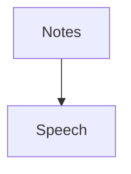

# AI-PM-Playground
A space to explore AI product management concepts and ideas.

## Project: AI Meeting Notes Summarizer
A concept for an AI-driven tool that automatically summarizes meeting notes to save time and boost productivity.

### Problem Statement
Busy professionals often struggle to distill key points from lengthy meeting notes, wasting time on manual reviews.

### Target Users
- Managers and team leads
- Remote workers juggling multiple meetings
- Anyone who hates re-reading Zoom transcripts

### Proposed Solution
An AI tool that:
- Ingests raw meeting notes (text or audio input).
- Uses NLP to extract key points, decisions, and action items.
- Outputs a concise summary (e.g., 3-5 bullet points).

### Workflow
Here’s how the AI Meeting Notes Summarizer processes inputs into summaries:

### Tech Stack (Hypothetical)
- **Input**: Text files or speech-to-text API (e.g., Google Speech-to-Text).
- **AI**: NLP model like BERT or GPT via Hugging Face or OpenAI API.
- **Output**: Markdown or PDF summary.

### Success Metrics
- Time saved per user (>30 minutes/week).
- Summary accuracy (>90% key point capture).

### Explore More
- [Roadmap](roadmap.md): Development timeline.
- [Tech Requirements](tech-requirements.md): Engineering specs.
- [Metrics Dashboard](metrics-dashboard.md): Success tracking.
- [User Story](user-story.md): User perspective.
- [Sample Notes](sample-meeting-notes.txt): Input example.
- [Sample Summary](sample-summary.md): Output example.

### Status
Initial concept drafted—seeking feedback!
